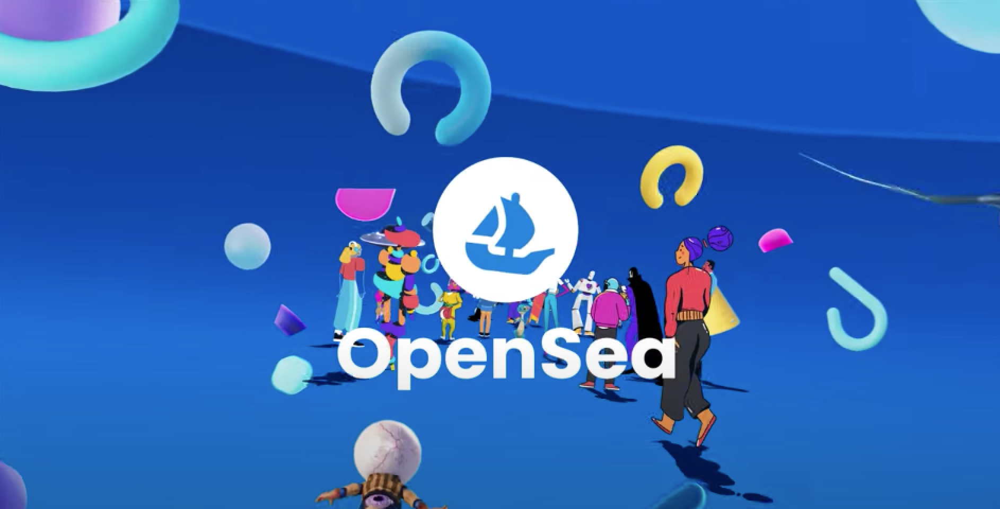

# OpenSea
*Unit 1 HW case study*
# OpenSea: Navigating Blockchain & Crypto 

## **Overview and Origin**

* Company Name: OpenSea

* Founded: December 2017

* Founders: Alex Atallah & Devin Finzer

 

## **Evolution & Growth of OpenSea**

The company came about after both Atallah & Finzer had worked previously at start ups and listened to what users had wanted and what they were looking for. Atallah & Finzer both point out they were fortunate enough to come into the marketplace at the 'right time'.

OpenSea was initially generating an income of $28,000 a month 4 years ago. It now generates a gross revenue of $873 million as of the close of 2021.  The servicing fees is 2.5% of the value of the sale whenever a digital asset is sold. 

As of January 2022, the latest funding was generated through a series c round which brought 48 investors to the table.  OpenSea has also acquired two additional organizations over the last four years. This has now brought the value of the company to $13.3 billion dollars.

## **Business Activities:**

Recently, there was issues arising from a loophole where NFTs were purchased for a fraction of their true cost then resold for thousands.  OpenSea then found themselves reimbursing those who had been affected by these sales.  

The loophole, which has now been fixed and is being monitored, gave sellers the ability to relist an NFT without cancelling the previous listing.  A spokesperson explained that this had not been an exploit or bug, but was instead an issue due to the nature of the blockchain.

With over half a million users who are now registered with OpenSea, it is an open playground to discover, trade, buy, & sell NFTs for anyone who is interested.   The site alone attracts over 120 million visitors per month and is the largest NFT marketplace as of today holding a marketshare of over 90%.

OpenSea has a leg up in its industry by offering the largest variety of NFTs with a peer-to-peer marketplace for crypto collectibles as well.  They also offer competitve commissions and some of the industries leading security in transactions. The cons of using OpenSea is that it only accepts payments in cryptocurrency and as a consumer you will need a crypto wallet to buy and sell on the platform.

One of the technologies OpenSea is currently using is they allow users to own & purchase their NFT's by using Ethereum's blockchain, Coinbase Wallet, Fortmatic, and Dapper.

## **Landscape:**

OpenSea falls within the domain of cryptocurrency and blockchain.

Cryptocurrency has grown exponentially and continues to grow within the financial and technology realm.  While crypto was initially viewed with skepticism it is now a market that exceeds $1.6 trillion and estimates 300 million users worldwide. Many of these institutions are now actively allocating capital into crypto.

NFTs or non-fungible tokens are now creating a stir and have become relatively mainstream as of 2021.  

Some of the major competitors with OpenSea are Smart Valor, Syscoin, Dapp.com, and bitFlyer.

## **Results**

The business impact of OpenSea has been that it has provided the largest variety of NFTs as of today. It also allows consumers to buy, sell, and trade by using crypto.

The core metrics of a trading platform in the crypto world like OpenSea are NFT's utility, rarity, community size, trading volume, potential, and provenance.  OpenSea is at the top of many of these metrics by being able to not only provide the most rare and largest variety of NFTs but also has one of the largest subscribing communities of 1.8 million.

OpenSea is currently one of the largest NFT trading platforms with the widest selection of NFTs for purchase.

## Recommendations

If there was an option to add users to be able to buy and sell using currency outside of crypto wallets I believe this would bring a higher number of consumers to the platform.

The technologies that would be needed to be added to have users be able to use funds outside of the crypto wallet would have to be secure payment methods.  There would have to be extreme security considering the high dollar of transactions and minimize theft and fraud both in purchases and sales.

## References & Citations
www.opensea.io
www.forbes.com
www.businessinsider.com
www.nerdwallet.com